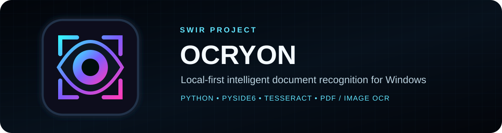

<!-- SWIR-README-STANDARD:v2 -->

<div align="center">



<br>


**Local-first intelligent document recognition for Windows.**

[**Highlights**](#-highlights) · [**Quick Start**](#-quick-start) · [**Roadmap**](#-roadmap) · [**Releases**](#-releases)

</div>

## Project status

| Item | Status |
|---|---|
| Current stage | **0.2.0 Alpha — active development** |
| Source version | `0.2.0a1` |
| Public test build | `v0.1.0-beta.1` — frozen |
| Roadmap | **17 / 22 = 77.3%** |
| Desktop target | Windows 10/11 |
| License | To be selected before the first stable release |

The frozen `v0.1.0-beta.1` remains the historical public test build. Development continues on `dev/0.2.0`; it is not rewritten or relabeled as the 0.2 candidate.

## Overview

**OCRYON** is an open-source desktop OCR application focused on private, local conversion of scans, screenshots, photos and PDF pages into editable text.

Recognition is separated from the interface so the OCR pipeline can evolve without coupling it to the Windows GUI. Current development uses a Tesseract backend and keeps document processing local to the machine.

## ⚡ Highlights

| Feature | What it does |
|---|---|
| 👁️ Local OCR | Processes documents on the user's computer instead of requiring a hosted OCR service. |
| 🖼️ Image + PDF import | Loads images and multi-page PDF documents for page-by-page recognition. |
| 🧵 Background recognition | Runs OCR outside the GUI thread to keep the desktop interface responsive. |
| 📚 Batch OCR | Recognizes all loaded pages in one workflow. |
| 🧹 Automatic preprocessing | Applies the current automatic OCR image-preparation pipeline before recognition. |
| ✏️ Editable results | Keeps recognized text editable per page. |
| 📐 Word coordinates | Captures word-level OCR coordinates for layout-aware export paths. |
| 📄 Multiple exports | Supports TXT, DOCX and searchable PDF output. |
| 🌍 Bundled language data path | Release candidates are designed to bundle the OCR runtime with ENG/PL/NOR data. |
| 🪟 Windows packaging | Includes Windows EXE/ZIP and installer pipelines. |

## 🚀 Quick Start

### From source

OCRYON requires **Python 3.12 or newer**.

```powershell
git clone https://github.com/Swir/OCRYON.git
cd OCRYON
py -3.12 -m venv .venv
.\.venv\Scripts\Activate.ps1
python -m pip install -e .
ocryon
```

You can also launch the package directly:

```powershell
python -m ocryon
```

### Development OCR backend

Current source builds use Tesseract. Either make `tesseract.exe` available on `PATH` or point OCRYON to a local executable:

```powershell
$env:OCRYON_TESSERACT = "C:\Program Files\Tesseract-OCR\tesseract.exe"
ocryon
```

Release-candidate packaging is intended to bundle the runtime and ENG/PL/NOR language data so the packaged tester does not need a separate OCR installation.

## Requirements / compatibility

- **OS target:** Windows 10/11.
- **Python:** 3.12+ for source development.
- **Desktop UI:** PySide6 / Qt.
- **Document stack:** PyMuPDF, Pillow and python-docx.
- **OCR backend:** Tesseract via pytesseract.
- **Source/dev OCR:** local Tesseract installation or explicit `OCRYON_TESSERACT` path.
- **Packaged 0.2 candidate:** must still pass the frozen Windows ZIP/EXE/installer smoke gate before stable 0.2.0.

## Usage

1. Open an image or multi-page PDF.
2. Preview individual pages.
3. Recognize one page or the complete loaded batch.
4. OCR runs outside the GUI thread.
5. Word-level coordinates are captured for layout-aware exports.
6. Edit recognized text per page.
7. Export the result to TXT, DOCX or searchable PDF.

Manual edits intentionally invalidate stale OCR coordinates for that page. Searchable-PDF export then falls back to the edited page text rather than exporting mismatched layout data.

## Technology / architecture

| Layer | Current technology |
|---|---|
| Runtime | Python 3.12+ |
| Desktop GUI | PySide6 / Qt |
| PDF handling | PyMuPDF |
| Image handling | Pillow |
| OCR | pytesseract + Tesseract |
| DOCX export | python-docx |
| Packaging | PyInstaller + Windows installer pipeline |

The OCR engine is kept separate from UI code so recognition backends and preprocessing can be extended without turning the GUI into the OCR implementation itself.

## 🧭 Roadmap

**Verified roadmap progress:** **17 / 22 = 77.3%**. README/branding work does not increase this percentage.

- [x] Project architecture
- [x] Windows-first desktop target
- [x] Image/PDF import
- [x] Document preview
- [x] Offline OCR backend architecture
- [x] Editable per-page recognition results
- [x] Background OCR without freezing the GUI
- [x] Batch OCR for all loaded pages
- [x] Automatic OCR image preprocessing
- [x] TXT export
- [x] DOCX export
- [x] Searchable PDF export with invisible OCR text layer
- [x] Original OCRYON application mark
- [x] Bundled OCR runtime and ENG/PL/NOR language data
- [x] Windows EXE/ZIP packaging pipeline
- [x] Windows installer pipeline
- [x] Word-level OCR coordinates and first-pass layout reconstruction
- [ ] Advanced preprocessing controls
- [ ] Accessibility and HiDPI polish
- [ ] Diagnostics and recovery UI
- [ ] 0.2.0 frozen Windows package/installer smoke
- [ ] Stable 0.2.0 release

## Releases

### Public test beta

`v0.1.0-beta.1` is the frozen public test baseline.

### 0.2.0

The `dev/0.2.0` line is still under active qualification. A stable 0.2.0 release is **not** claimed until the remaining feature, accessibility/diagnostics, Windows package/installer smoke and release gates are complete.

## Safety / limitations

- OCR quality depends on source-image quality, language data, preprocessing and the underlying OCR engine; no universal accuracy claim is made.
- OCRYON is local-first, but users remain responsible for handling sensitive documents and exported files appropriately.
- Searchable-PDF layout reconstruction is still evolving.
- Advanced preprocessing controls, accessibility/HiDPI polish and diagnostics/recovery UI remain open roadmap items.
- The 0.2.0 Windows package/installer is not considered release-qualified until its dedicated smoke gate passes.

## 🔎 Search Keywords

`windows ocr app` • `offline ocr windows` • `python pyside6 ocr` • `tesseract desktop gui` • `pdf to editable text` • `image to text windows` • `searchable pdf ocr` • `local document recognition` • `batch ocr windows` • `scan to text desktop` • `docx ocr export` • `private offline ocr`

<div align="center">

### `SCAN • RECOGNIZE • EDIT • EXPORT`

⭐ **If OCRYON is useful, consider leaving a star.**

[**← SWIR profile**](https://github.com/Swir) · [**All projects →**](https://github.com/Swir?tab=repositories)

</div>
